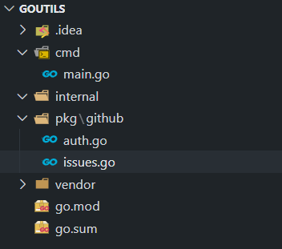

Presenting github eyes, a golang implementation of the github rest apis using [Google GitHub](https://github.com/google/go-github) sdk to interact with the [Github Api](https://docs.github.com/en/rest), using github apis we can crawl over multiple repository and automate different tasks from creating repo, creating labels, adding milestones, get latest commits, updating workflows, get the project build status etc, below is the basic demonstration of getting list of issues from multiple repos. 


The go-github library does not directly handle authentication. The easiest and recommended way to do this is using the OAuth2 library, If you have an OAuth2 access token (for example, a personal API token), you can use it with the OAuth2 library.
To get the personal api token follow the [documentation](https://docs.github.com/en/github/authenticating-to-github/creating-a-personal-access-token) and 
Below is the code snippet for authentication using [oauth2](https://github.com/golang/oauth2).

```go title="auth.go"
package github

import (
	"context"

	"github.com/google/go-github/v33/github"
	"golang.org/x/oauth2"
)

AUthenticating using github access token
// AuthGithubAPI authentication of github api
func AuthGithubAPI(ctx context.Context) *github.Client {
	ts := oauth2.StaticTokenSource(
		&oauth2.Token{AccessToken: "XXXXXXXXXXXXXXXXXXXXXXX"},
	)
	tc := oauth2.NewClient(ctx, ts)
	return github.NewClient(tc)
}
```

Getting the list of issues in a repository, here we have created a struct named `Issues` with the required fields and then created a function `ListIssues` where we are passing the github api authentication and then `client.Issues.ListByRepo` is doing the job where underneath its calling [Github Issues Api](https://docs.github.com/en/free-pro-team@latest/rest/reference/issues/#list-repository-issues).   
We can also extend this function by adding filters to get open/closed issues and so on.
```go title="issues.go"
package github

import (
	"context"
	"log"
	"time"
)

type Issues struct {
	ID        int64
	Title     string
	State     string
	CreatedAt time.Time
	URL       string
}

// ListIssues get list of issues
func ListIssues(repos string) interface{}{
	ctx := context.Background()
	client := AuthGithubAPI(ctx)
	issues, _, err := client.Issues.ListByRepo(ctx, "dipjyotimetia", repos, nil)
	if err != nil {
		log.Println(err)
	}

	var issueList []interface{}
	for _, v := range issues {
		issueList = append(issueList,&Issues{
			ID:        v.GetID(),
			Title:     v.GetTitle(),
			State:     v.GetState(),
			CreatedAt: v.GetCreatedAt(),
			URL:       v.GetHTMLURL(),
		})
	}
	return issueList
}
```

Main function to drive the show, here we are passing the repo names in an array called `repoNames` and in a loop calling the the function derived above `ListIssues` and then generating the result in a json file in local path.
```go title="main.go"
package main

import (
	"encoding/json"
	"github.com/goutils/pkg/github"
	"io/ioutil"
)

func main() {
	repoNames := []string{"HybridTestFramewrok", "MobileTestFramework"}
	var result []interface{}
	for _, repoName := range repoNames {
		result = append(result, repoName, github.ListIssues(repoName))
	}

	file, _ := json.MarshalIndent(result, "", "")
	_ = ioutil.WriteFile("test.json", file, 0644)
}

```
Example of the exported json data of the `ListIssues` function for the two repos.
```json
[
  "HybridTestFramewrok",
  [
    {
      "ID": 690950907,
      "Title": "Add reddis tests support",
      "State": "open",
      "CreatedAt": "2020-09-02T11:42:07Z",
      "URL": "https://github.com/dipjyotimetia/HybridTestFramewrok/issues/65"
    },
    {
      "ID": 690950833,
      "Title": "Add ssh login builder",
      "State": "open",
      "CreatedAt": "2020-09-02T11:42:01Z",
      "URL": "https://github.com/dipjyotimetia/HybridTestFramewrok/issues/64"
    },
    {
      "ID": 690950781,
      "Title": "Add file reader validations",
      "State": "open",
      "CreatedAt": "2020-09-02T11:41:55Z",
      "URL": "https://github.com/dipjyotimetia/HybridTestFramewrok/issues/63"
    },
    {
      "ID": 690950708,
      "Title": "add kafka testing",
      "State": "open",
      "CreatedAt": "2020-09-02T11:41:48Z",
      "URL": "https://github.com/dipjyotimetia/HybridTestFramewrok/issues/62"
    },
    {
      "ID": 690950641,
      "Title": "add rabitmq testing support",
      "State": "open",
      "CreatedAt": "2020-09-02T11:41:43Z",
      "URL": "https://github.com/dipjyotimetia/HybridTestFramewrok/issues/61"
    }
  ],
  "MobileTestFramework",
  [
    {
      "ID": 793821012,
      "Title": "Add AWS Device Farm support",
      "State": "open",
      "CreatedAt": "2021-01-26T00:19:55Z",
      "URL": "https://github.com/dipjyotimetia/MobileTestFramework/issues/88"
    }
  ]
]
```

Project structure   
