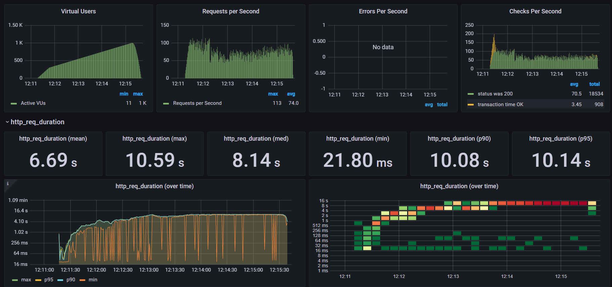
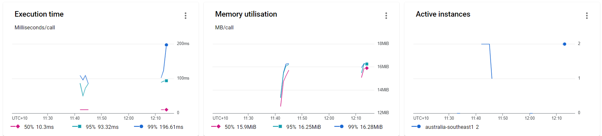

## What is serverless

Serverless computing is a method of providing backend services on an as-used basis. A serverless provider allows users to write and deploy code without the hassle of worrying about the underlying infrastructure. code executes in a fully managed environment and no need to provision any infrastructure.


## Introduction to cloud functions

Google Cloud Functions is a serverless execution environment for building and connecting cloud services. With Cloud Functions you write simple, single-purpose functions that are attached to events emitted from your cloud infrastructure and services. Your Cloud Function is triggered when an event being watched is fired. Your code executes in a fully managed environment. There is no need to provision any infrastructure or worry about managing any servers.

## Functions Framework
The Functions Framework lets you write lightweight functions that run in many different environments. [Functions framework](https://github.com/GoogleCloudPlatform/functions-framework)

```go
package main

import (
	"github.com/GoogleCloudPlatform/functions-framework-go/funcframework"
	p "github.com/cloudmock"
	"golang.org/x/net/context"
	"log"
	"os"
)

func main() {
	ctx := context.Background()
	if err := funcframework.RegisterHTTPFunctionContext(ctx, "/", p.GoMock); err != nil {
		log.Fatalf("funcframework.RegisterHTTPFunctionContext: %v\n", err)
	}
	port := "8080"
	if envPort := os.Getenv("PORT"); envPort != "" {
		port = envPort
	}
	if err := funcframework.Start(port); err != nil {
		log.Fatalf("funcframework.Start: %v\n", err)
	}
}

```

```go
package db

import (
	"context"
	"fmt"
	"log"
	"os"
	"time"

	"github.com/cloudmock/config"
	"github.com/cloudmock/secret"
	"go.mongodb.org/mongo-driver/mongo"
	"go.mongodb.org/mongo-driver/mongo/options"
)

const ENV = "ENVIRONMENT"

func NewDatabaseConnection() *mongo.Collection {
	var err error
	log.Print("Connecting to mongodb")
	conf, err := config.LoadConfigPath("config/app")
	if err != nil {
		log.Fatalf("")
	}
	env := os.Getenv(ENV)
	var client *mongo.Client

	conn, err := secret.GetSecrets()
	if err != nil {
		log.Fatalf("mongo db secret url failed %v", err)
	}
	if env == "dev" {
		fmt.Println("Connecting to localdb")
		client, err = mongo.NewClient(options.Client().SetAuth(
			options.Credential{
				Username: conf.DBuser,
				Password: conf.DBpassword,
			}).ApplyURI(conf.DBurl))
	} else {
		client, err = mongo.NewClient(options.Client().ApplyURI(conn))
	}

	if err != nil {
		log.Fatalf("mongo db client failed %v", err)
	}
	ctx, cancel := context.WithTimeout(context.Background(), 10*time.Second)
	defer cancel()
	err = client.Connect(ctx)
	if err != nil {
		log.Fatalf("mongo db connection failed %s", err) //nolint:gocritic
	}
	return client.Database("function").Collection("payments")
}

```

```go
package router

import (
	"encoding/json"
	"github.com/brianvoe/gofakeit/v6"
	"net/http"
)

type UserDetails struct {
	Name     string `json:"name"`
	Email    string `json:"email"`
	Phone    string `json:"phone"`
	Address  string `json:"address"`
	Company  string `json:"company"`
	JobTitle string `json:"jobTitle"`
}

func NewUserWrite() *[]UserDetails {
	var usr []UserDetails
	for i := 0; i < gofakeit.RandomInt([]int{5, 10, 12, 4, 11}); i++ {
		usr = append(usr, UserDetails{
			Name:     gofakeit.Name(),
			Email:    gofakeit.Email(),
			Phone:    gofakeit.Phone(),
			Address:  gofakeit.Address().Address,
			Company:  gofakeit.Company(),
			JobTitle: gofakeit.JobTitle(),
		})
	}
	return &usr
}

func User() func(w http.ResponseWriter, r *http.Request) {
	return func(w http.ResponseWriter, r *http.Request) {
		w.Header().Set("Content-Type", "application/json")
		jData, err := json.Marshal(NewUserWrite())
		if err != nil {
			http.Error(w, err.Error(), http.StatusInternalServerError)
			return
		}
		w.WriteHeader(http.StatusOK)
		w.Write(jData)
	}
}

```

```go
package p

import (
	"github.com/cloudmock/router"
	"github.com/go-chi/chi/v5"
	"github.com/go-chi/chi/v5/middleware"
	"github.com/go-chi/httprate"
	"github.com/rs/cors"
	"net/http"
	"time"
)

func GoMock(w http.ResponseWriter, r *http.Request) {
	rc := chi.NewRouter()
	conn := db.NewDatabaseConnection()

	rc.Use(middleware.RealIP)
	rc.Use(middleware.Logger)
	rc.Use(httprate.Limit(
		2,
		1*time.Second,
		httprate.WithLimitHandler(func(w http.ResponseWriter, r *http.Request) {
			http.Error(w, "too many requests", http.StatusTooManyRequests)
		}),
	))

	rc.Route("/api/v1", func(rc chi.Router) {
		rc.Get("/users", router.User())
		rc.Get("/categories", router.Category())
	})

	cors.Default().Handler(rc).ServeHTTP(w, r)
}

```

### Deploy cloud function

```yaml
name: Build and Deploy to CloudFunction

on:
  push:
    branches: [ main ]

jobs:
  deploy:
    name: deploy
    runs-on: ubuntu-latest
    steps:
      - uses: google-github-actions/setup-gcloud@master
        with:
          project_id: ${{ secrets.GCP_PROJECT_ID }}
          service_account_key: ${{ secrets.gcp_credentials }}
          export_default_credentials: true
      - uses: actions/checkout@v2
      - name: Deploy serverless function
        run: |
          gcloud functions deploy "GoMock" \
            --runtime go113 --trigger-http \
            --allow-unauthenticated \
            --region australia-southeast1 \
            --update-env-vars MONGODB=${{ secrets.mongo_secret }} \
            --max-instances 2 \
            --memory 128mb \
            --service-account=${{ secrets.service_account }} \
            --no-user-output-enabled
```

## Why Mocking using cloud function

## Use cases of mocking using cloud function

### System Testing

### Performance testing

Performance tests check the behaviors of the system when it is under significant load. These tests are non-functional and can have the various form to understand the reliability, stability, and availability of the platform. For instance, it can be observing response times when executing a high number of requests, or seeing how the system behaves with a significant of data.


