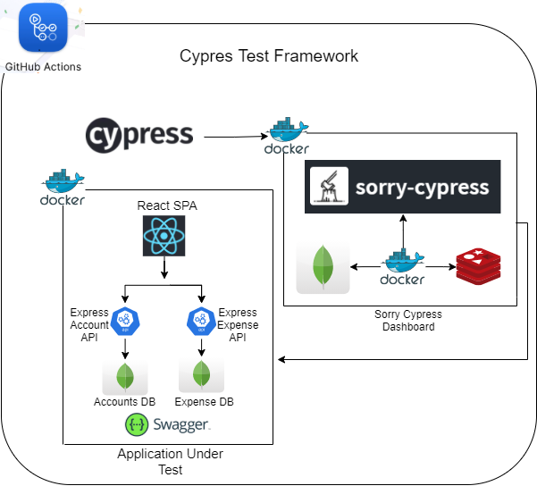
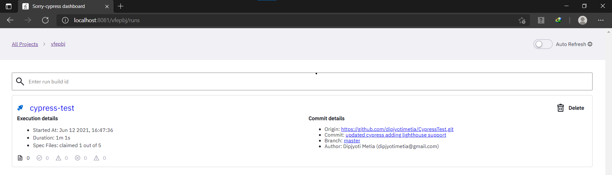
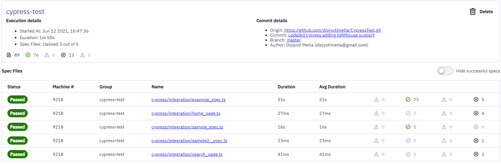
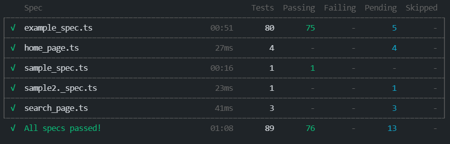

[](https://github.com/dipjyotimetia/CypressTest/actions)   
[](https://percy.io/d463521f/CypressTestFramework)   

## Cypress Test Framework



### Sorry Cypress Dashboard



### Cypress Test Result


### Installation:

- Install [nodejs 14.17 lts](https://nodejs.org/en/download/)
- Install [VS_Code](https://code.visualstudio.com/download)

### Project Setup:
```bash
$ git clone https://github.com/dipjyotimetia/CypressTestFramework.git
$ npm i
```
### Configure/update/set Test Environments:

- Open config and update test environment urls,user,pass and update it to config.js
- Test environment json files names are case sensitive
- To run test on specific environment update `configFile=uat or configFile=prod`

### Write Code:

- Add `/// <reference types="Cypress" />` and `/// <reference types="../support" />` if required `/// <reference types="cypress-downloadfile"/>` reference on the top, to get typed reference.
- Add new spec file with the format TC00*\_SampleTest*\_spec.js
- Write functions in PageObjects as E.g login
- Write helper methods in `_support/actions.ts_`
- Add test data in `_data/testdata.ts_`
- Add mock data files in `_fixtures/_`

### Test Code

```typescript
/// <reference types="Cypress" />
/// <reference path="../support/index.d.ts" />

import { loginPage } from "../pageObjects/login_page";
import { BASE_URL, USERNAME, PASSWORD } from "../config/config";

describe('Testing Web', function () {

    before(()=>{
        cy.mockGlobalFeeds();
        cy.mockTags();
    });

    it('Web Login', () => {
        loginPage.navigateToUrl(BASE_URL);
        loginPage.login(USERNAME, PASSWORD);
    });

});
```

#### Setup SorryCypress Dashboard:
- `docker-compose up -d`

#### Test:

- `test:cypress` run tests in sorry cypress dashboard
- `npm run cy:chrome` run tests in chrome browser
- `npm run cypress:open` for test development and run(_Test Watcher is set to false_)
- `npm run cy:test` run all tests in headless
- `npx cypress run --env configFile=test --headed --spec 'cypress/integration/TC002_Login_Spec.js'` To run specific test in chrome

### Generate Report Locally

- `npm run combine-reports` to combine mocha json report
- `npm run generate-report` to generate html report
