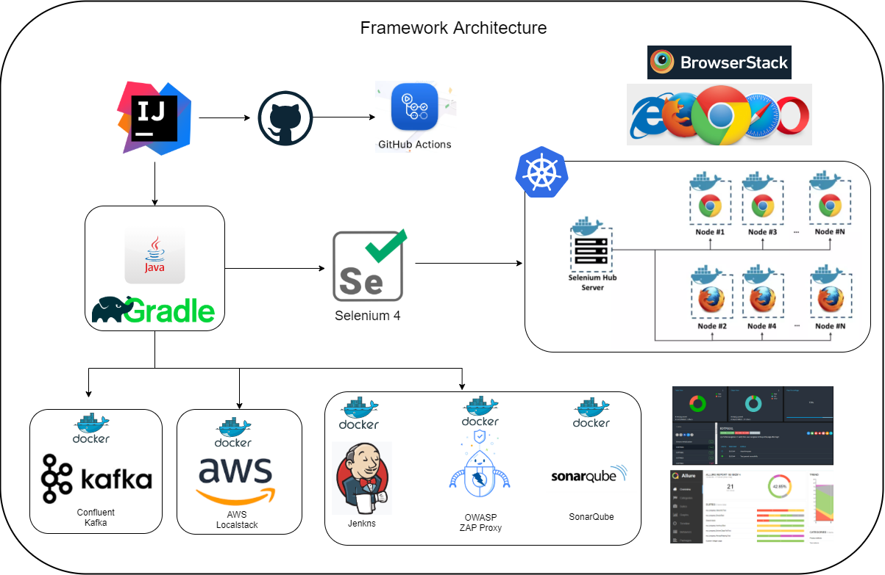
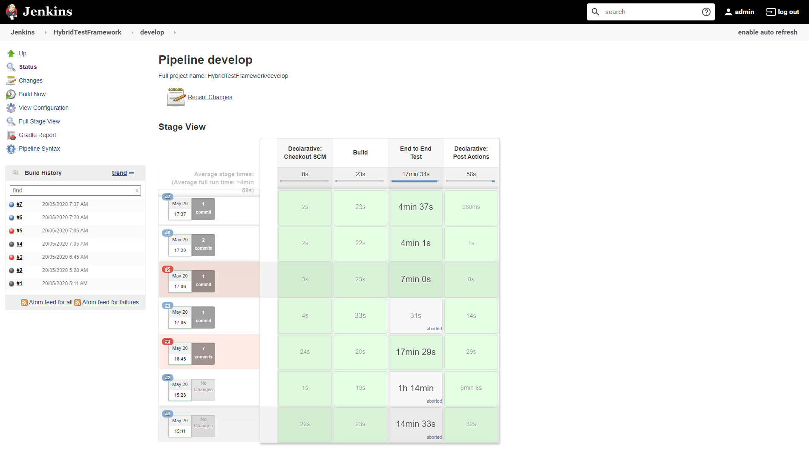
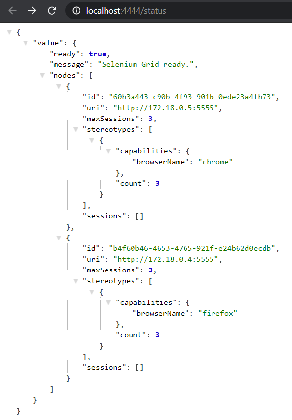
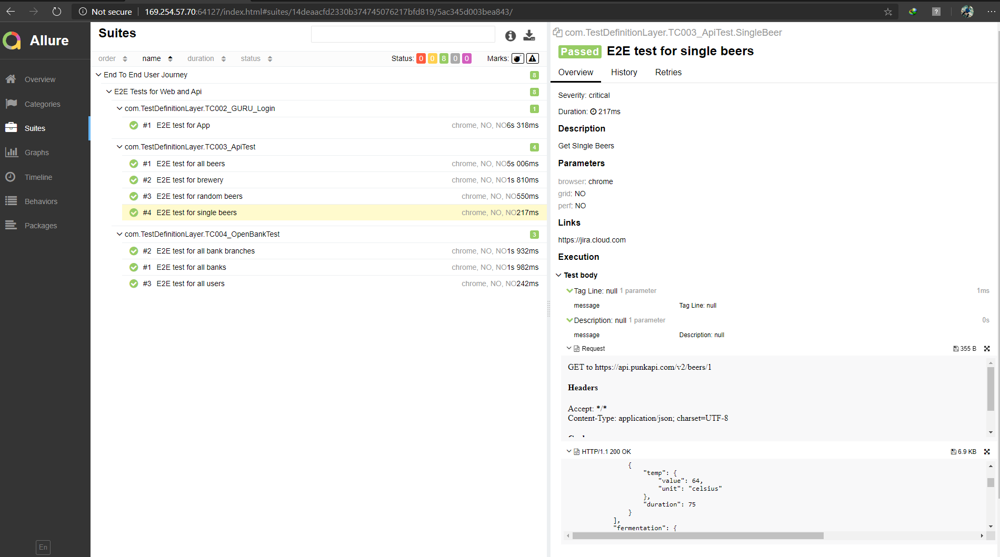
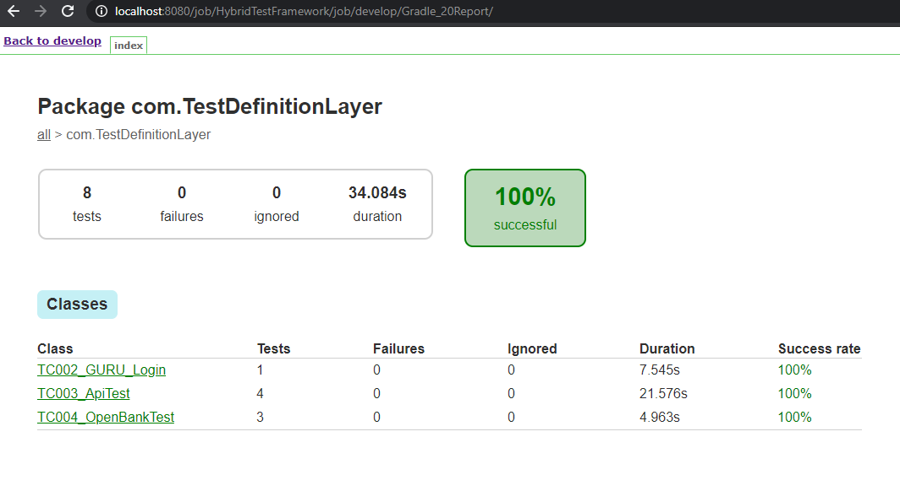
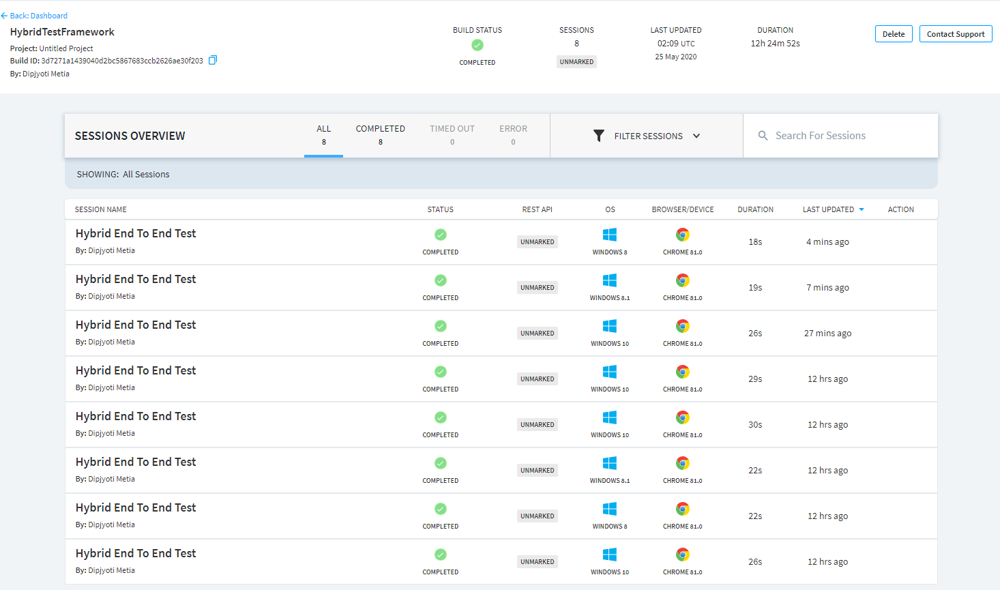
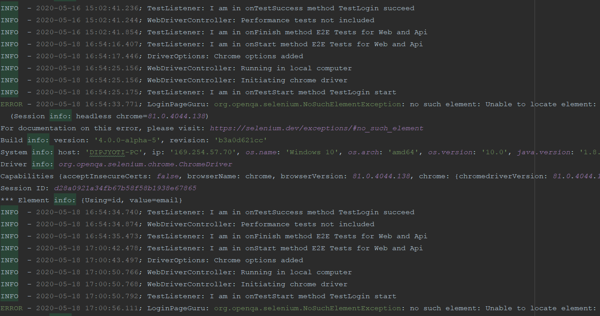

#### Full fledged WEB, API and Security testing framework using selenium,ZAP OWASP proxy and rest-assured

[](https://www.codacy.com/manual/dipjyotimetia/HybridTestFramewrok?utm_source=github.com&amp;utm_medium=referral&amp;utm_content=dipjyotimetia/HybridTestFramewrok&amp;utm_campaign=Badge_Grade)
[](https://percy.io/CypressTest/Selenium)

[](https://dev.azure.com/dipjyoti/OpensourceProjects/_build/latest?definitionId=7&branchName=master)  
[](https://www.jetbrains.com/?from=HybridTestFramework)

      

### Supported Platforms  
This framework supports WebUi automation across a variety of browsers like Chrome, Firefox, IE, no only limited to this but extended to test rest api, security and visual testing.

### Framework Capabilities
* Cross browser testing support
* Added BrowserStack support for CrossBrowser testing
* Running tests in docker containers selenium grid
* Running tests in AWS DeviceFarm selenium grid
* Running tests in selenium server in docker containers
* Security testing using OWASP, running in docker container
* Api testing support using RestAssured
* Visual regression testing using percy.io
* Accessibility testing using axe-selenium
* Stubbed api testing using WireMock
* Can send logs to ElasticSearch for kibana dashboard visualization
* Database testing support
* Kubernetes support
    
### Setup & Tools
* [Install IntelliJ IDEA](https://www.jetbrains.com/idea/download/)
* [Install docker desktop](https://www.docker.com/products/docker-desktop)
* [Java JDK_8](https://docs.aws.amazon.com/corretto/latest/corretto-8-ug/downloads-list.html)
* [Gradle](https://gradle.org/next-steps/?version=6.4&format=bin)
* [Allure](https://github.com/allure-framework/allure2/archive/2.13.8.zip)    
* Set Environment variables  
```bash    
  * JAVA_HOME: Pointing to the Java SDK folder\bin
  * GRADLE_HOME: Pointing to Gradle directory\bin      
  * ALLURE_HOME: Pointing to allure directory\bin  
```
### Getting Started
```bash
$ git clone 
$ cd 
$ import project from IntelliJ IDEA as a gradle project
$ gradle clean
$ gradle build
$ gradle task E2E
$ gradle allureReport
$ gradle allureServe
```
### Docker Compose
> Spawns chrome, firefox, selenium hub and OWASP proxy server    
```bash
$ docker-compose up -d
```
> Complete infrastructure creation for local run
```bash
$ docker-compose -f docker-compose-infra up -d
```
> Spawns four additional node-chrome/firefox instances linked to the hub
```bash
$ docker-compose scale chrome=5
$ docker-compose scale firefox=5
```
:::tip
### Write your first user journey
 - Create new class and name as the `TC00*_E2E_TEST-***`
 - Provide jira link in `@Link`
 - Provide all the api components as `@Feature`
 - Provide test severity and description
 - Write test
 - Use CatchBlock in `try/catch` section
:::

### JenkinsExecution  
  

### Selenium GridServer 2.0
    

### Allure Reporting 2.0
    

### Gradle Report
  

### BrowserStack Dashboard
      

### LogsView
