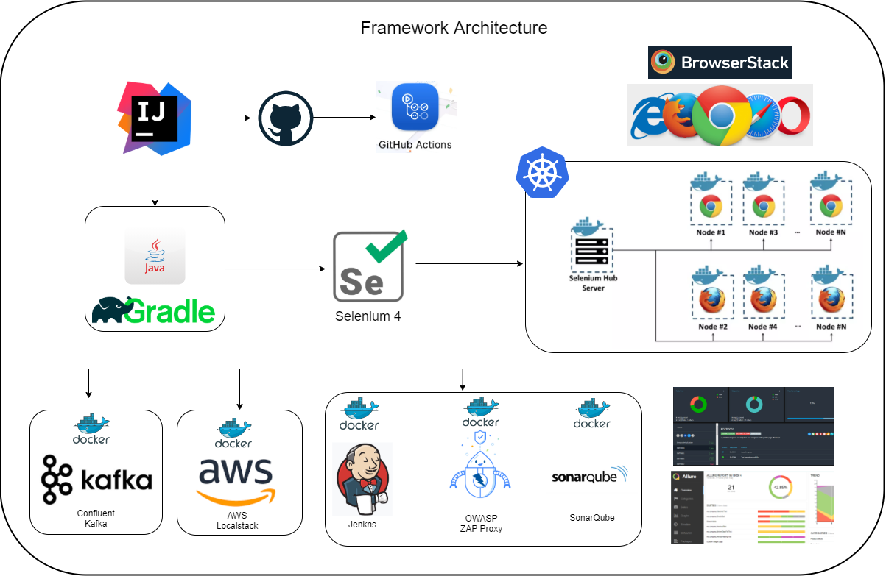
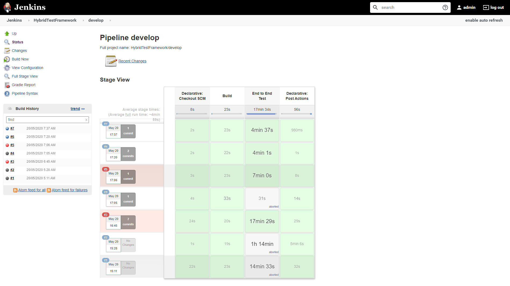
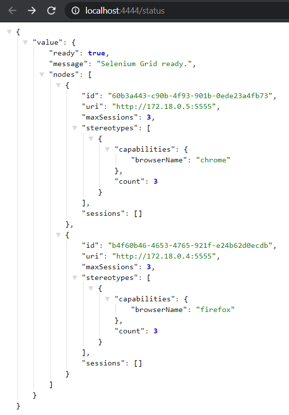
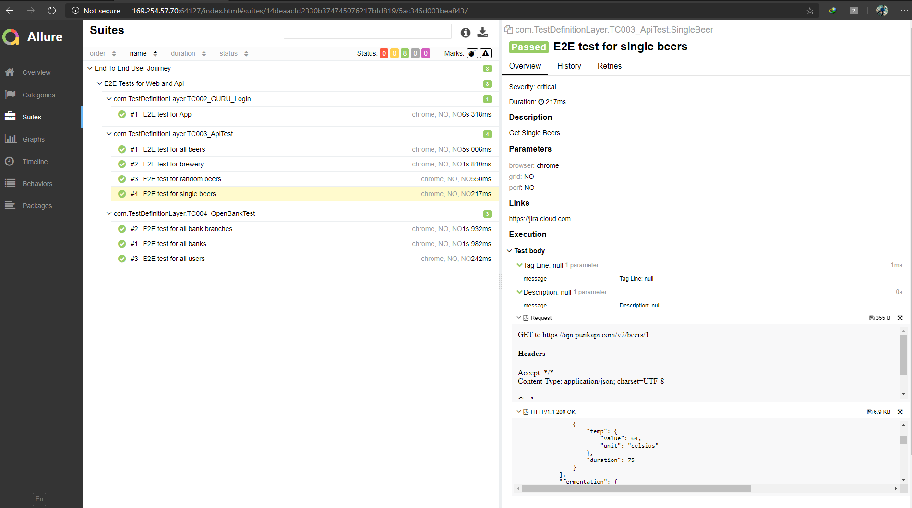
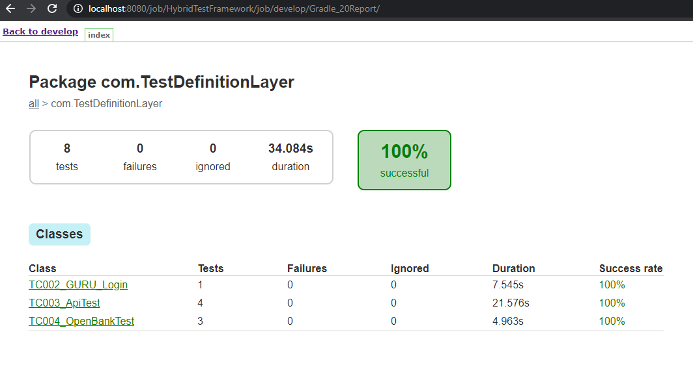
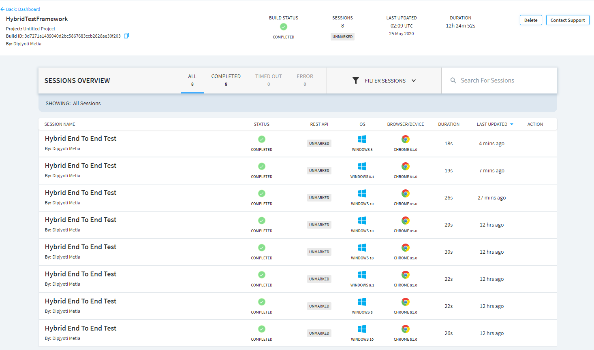
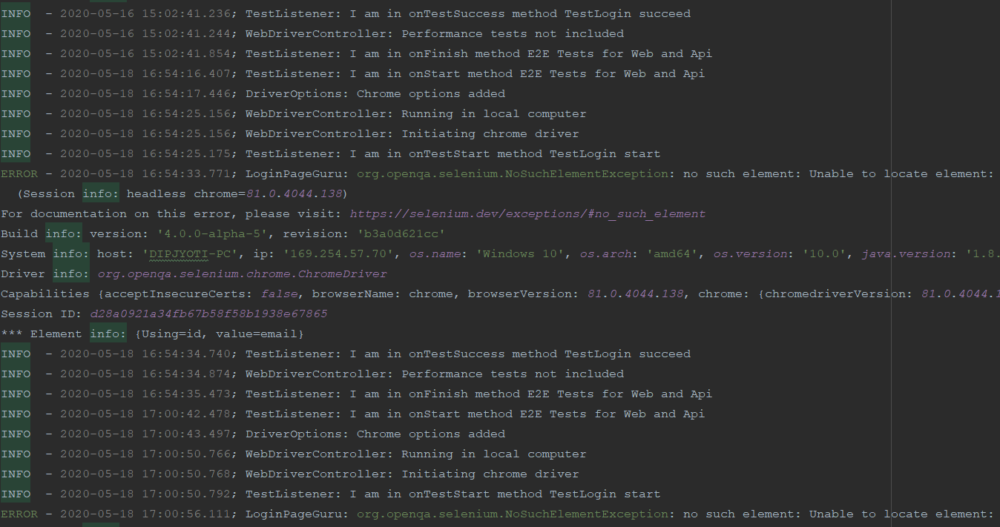

#### Full fledged WEB, API and Security testing framework using selenium,ZAP OWASP proxy and rest-assured

[](https://percy.io/CypressTest/Selenium)

[](https://dev.azure.com/dipjyoti/OpensourceProjects/_build/latest?definitionId=7&branchName=master)  
[](https://www.jetbrains.com/?from=HybridTestFramework)



### Supported Platforms  

This framework supports WebUi automation across a variety of browsers like Chrome, Firefox, IE, no only limited to this but extended to test rest api, security and visual testing.

### Framework Capabilities

* Cross browser testing support
* Added BrowserStack support for CrossBrowser testing
* Running tests in docker containers selenium grid
* Running tests in AWS DeviceFarm selenium grid
* Running tests in selenium server in docker containers
* Security testing using OWASP, running in docker container
* Api testing support using RestAssured
* Visual regression testing using percy.io
* Accessibility testing using axe-selenium
* Stubbed api testing using WireMock
* Can send logs to ElasticSearch for kibana dashboard visualization
* Database testing support
* Kafka testing support
* Kubernetes support

### Setup & Tools

* [Install IntelliJ IDEA](https://www.jetbrains.com/idea/download/)
* [Install docker desktop](https://www.docker.com/products/docker-desktop)
* [Java JDK_11](https://adoptopenjdk.net/)
* [Gradle](https://gradle.org/next-steps/?version=6.9&format=bin)
* [Allure](https://github.com/allure-framework/allure2/archive/2.14.0.zip)
* Set Environment variables  

```bash
  * JAVA_HOME: Pointing to the Java SDK folder\bin
  * GRADLE_HOME: Pointing to Gradle directory\bin      
  * ALLURE_HOME: Pointing to allure directory\bin  
```

### Getting Started

```bash
git clone 
import project from IntelliJ IDEA as a gradle project
gradle clean
gradle build
gradle task E2E
gradle allureReport
gradle allureServe
```

### Docker Compose
>
> Spin-up chrome, firefox, selenium hub and OWASP proxy server

```bash
docker-compose up -d
```

> Complete infrastructure creation for local run

```bash
docker-compose -f docker-compose-infra up -d
```

> Spin-up four additional node-chrome/firefox instances linked to the hub

```bash
docker-compose scale chrome=5
docker-compose scale firefox=5
```

> Spin-up kafka instances

```shell
docker-compose -f docker-compose-kafka.yml up
docker-compose -f docker-compose-kafka.yml down --rmi all
```

> Spin-up selenium hub in kubernetes instance

```shell
$ kubectl apply -f selenium-k8s-deploy-svc.yaml
$ kubectl apply -f https://raw.githubusercontent.com/kubernetes/dashboard/v2.0.0/aio/deploy/recommended.yaml
$ kubectl proxy
$ kubectl describe secret -n kube-system | grep deployment -A 12
## To delete deployments
$ kubectl delete deployment selenium-node-firefox
$ kubectl delete deployment selenium-node-chrome
$ kubectl delete deployment selenium-hub
```

:::tip

### Write your first user journey

* Create new class and name as the `TC00*_E2E_TEST-***`
* Provide jira link in `@Link`
* Provide all the api components as `@Feature`
* Provide test severity and description
* Write test
* Use CatchBlock in `try/catch` section
:::

### JenkinsExecution  

  

### Selenium GridServer 2.0



### Allure Reporting 2.0



### Gradle Report

  

### BrowserStack Dashboard



### LogsView


