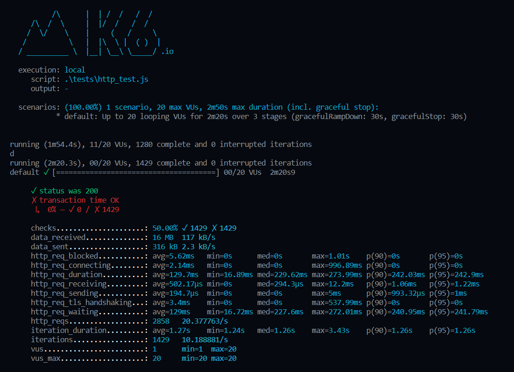
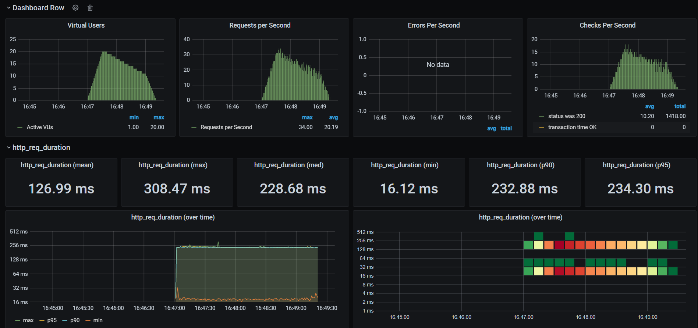
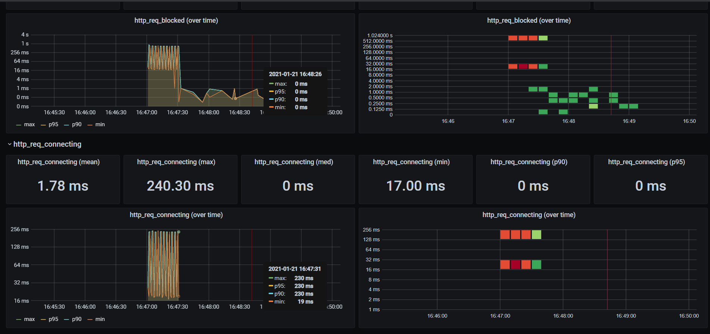

There are couple of load testing tools present in the market, K6 is one of them which looks more promising in
the field of modern performance testing, which not only provides the best in class developer experience but
also it has robust code base maintained by multiple open source contributors.


```javascript
import http from "k6/http";
import { check, group, sleep } from "k6";
import { Rate } from "k6/metrics";

// A custom metric to track failure rates
var failureRate = new Rate("check_failure_rate");

export let options = {
  thresholds: {
    // We want the 95th percentile of all HTTP request durations to be less than 500ms
    "http_req_duration": ["p(95)<500"],
    // Requests with the staticAsset tag should finish even faster
    "http_req_duration{staticAsset:yes}": ["p(99)<250"],
    // Thresholds based on the custom metric we defined and use to track application failures
    "check_failure_rate": [
      // Global failure rate should be less than 1%
      "rate<0.01",
      // Abort the test early if it climbs over 5%
      { threshold: "rate<=0.05", abortOnFail: true },
    ],
  },
};

export default function () {
  let response = http.get("https://test.k6.io/");

    // check() returns false if any of the specified conditions fail
    let checkRes = check(response, {
        "http2 is used": (r) => r.proto === "HTTP/2.0",
        "status is 200": (r) => r.status === 200,
        "content is present": (r) => r.body.indexOf("Collection of simple web-pages suitable for load testing.") !== -1,
    });

    // We reverse the check() result since we want to count the failures
    failureRate.add(!checkRes);

    // Load static assets, all requests
    group("Static Assets", function () {
        // Execute multiple requests in parallel like a browser, to fetch some static resources
        let resps = http.batch([
            ["GET", "https://test.k6.io/static/css/site.css", null, { tags: { staticAsset: "yes" } }],
            ["GET", "https://test.k6.io/static/favicon.ico", null, { tags: { staticAsset: "yes" } }],
            ["GET", "https://test.k6.io/static/js/prisms.js", null, { tags: { staticAsset: "yes" } }],
        ]);
        // Combine check() call with failure tracking
        failureRate.add(!check(resps, {
            "status is 200": (r) => r[0].status === 200 && r[1].status === 200,
            "reused connection": (r) => r[0].timings.connecting == 0,
        }));
    });

    sleep(Math.random() * 3 + 2); // Random sleep between 2s and 5s
}
```

```javascript
import http from "k6/http";
import { check, sleep } from "k6";

// `options.stages to configure ramp up/down VU level
export let options = {
  stages: [
    { duration: "30s", target: 20 },
    { duration: "1m30s", target: 10 },
    { duration: "20s", target: 0 },
  ]
}

// this defines the entry point for your VUs
// similar to the main() function in many other language

export default function() {
  let res = http.get("http://test.loadimpact.com");
  
  // check() function to verify status code, transaction time etc
  check(res, {
    "status was 200": (r) => r.status == 200,
    "transaction time OK": (r) => r.timings.duration < 200
  });
  sleep(1);
}
```






