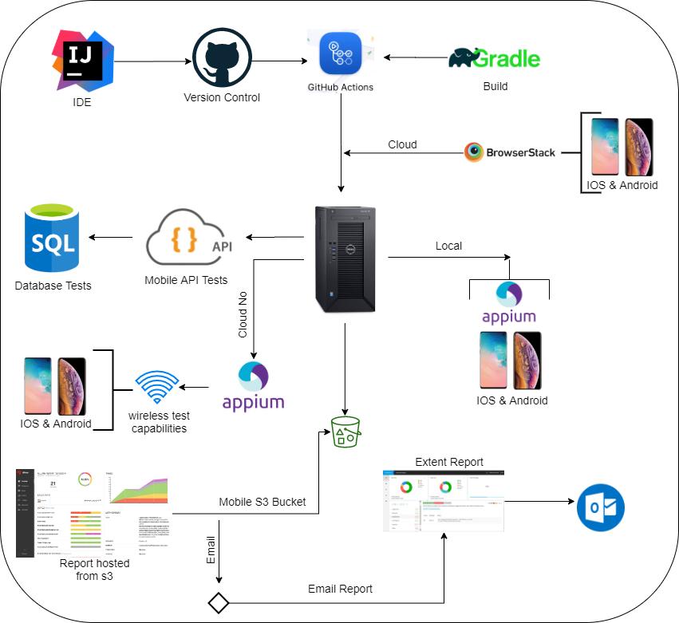

#### Full fledged Mobile, API and Database framework using appium and rest-assured




### Supported Platforms  

Appium supports app automation across a variety of platforms, like iOS,Android, from Windows platform. Each platform is supported by one or more "drivers",
which know how to automate that particular platform. Choose a driver below for specific information about how that driver works and how to set it up:

* Android
  * The [UiAutomator2 Driver](http://appium.io/docs/en/drivers/android-uiautomator2/)
* IOS
  * The [XCUITest](http://appium.io/docs/en/drivers/ios-xcuitest/)  

### [Why Appium](http://appium.io/docs/en/about-appium/intro/)?

* Appium is an Open source automation tool used for cross platform testing like native, hybrid and web applications  on both the platforms IOS and Android.
  Its capability for testing all kinds of tools under one platform, makes it a multipurpose and convenient testing tool. Appium is called as a cross platform
  testing tool because it uses JSON wire protocol internally to interact with native apps of IOS and Android using Selenium Webdriver.

### Setup & Tools

* Download and install [Nodejs](https://nodejs.org/en/download/)
  ``
  npm install -g appium
  ``  
  ``
  npm install -g appium-doctor
  ``
verify all appium dependencies  
* [Download Appium Desktop](https://github.com/appium/appium-desktop/releases) download latest release
* [Install InteliJ IDEA](https://www.jetbrains.com/idea/download/)
* [Java JDK_8](https://docs.aws.amazon.com/corretto/latest/corretto-8-ug/downloads-list.html)
* [Gradle](https://gradle.org/next-steps/?version=6.7.1&format=bin)
* [Allure](https://github.com/allure-framework/allure2/archive/2.13.8.zip)
* Set Environment variables

```bash
  * JAVA_HOME: Pointing to the Java SDK folder\bin
  * GRADLE_HOME: Pointing to Gradle directory\bin
  * ALLURE_HOME: Pointing to allure directory\bin
  * APPIUM_HOME: Pointing appium main.js from global location
  * NODE_HOME: Pointing to nodejs installation path
```

* For more details navigate to the above [Wiki Page](https://github.com/dipjyotimetia/MobileTestFramework/wiki)

### Connect - Local Devices

Connect an Android and an iOS Device using a USB cable to your PC

* Follow documentation for device connection

### Getting Started

```bash
git clone 
cd 
import project from InteliJ as a gradle project
gradle clean
gradle build
gradle task E2E
allureServe
```

### Write your first user journey

* Create new class and name as the `TC00*_E2E_TEST-***`
* Provide jira link in `@Link`
* Provide all the api components as `@Feature`
* Provide test severity and description
* Write test
* Use CatchBlock in `try/catch` section
