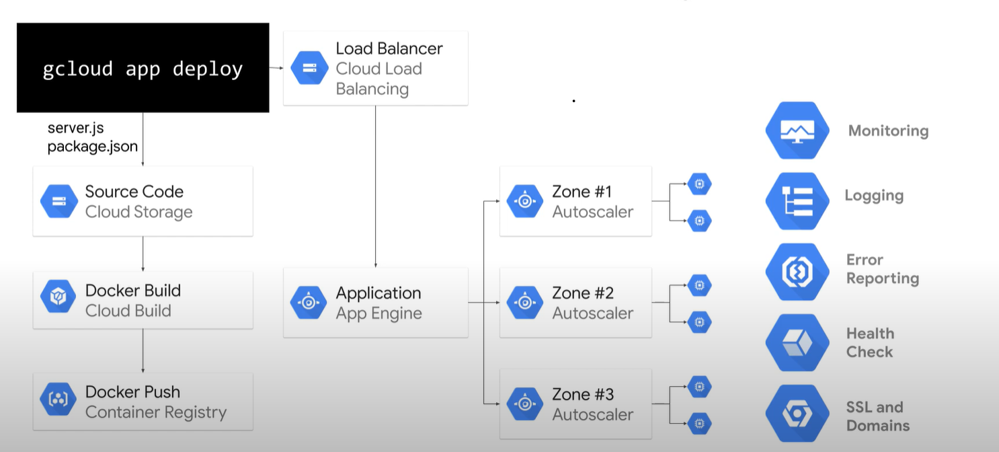
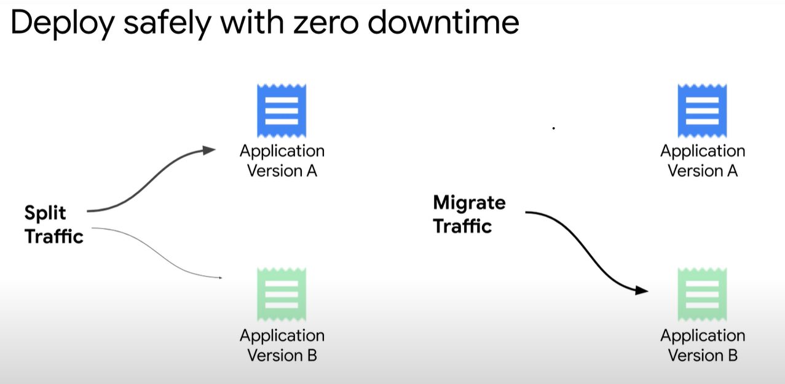

Fully managed serverless application service - develop and deploy applications
Supports all popular languages and frameworks

Ideal for applications using a microservices architecture
Ideal for applications that need rapid scaling and frequent traffic spikes.
Cost effective as pay as you go

Endpoint: ********.appspot.com

App engine can be used to do canary deployment and split traffic to do the AB testing.

App Engine standard environments is option for applications with spiky or very low traffic with app engine standard apis.

Difference between app engine flexible and standard

App engine Flexible gives all the technological capabilities with the only bound of using containers

