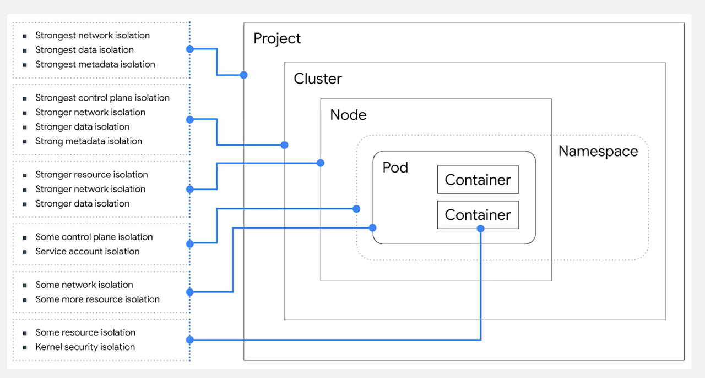

Kubernetes is a container orchestration tool, helps manage multiple container, nodes and pods, provided services like health checks, scheduling and scaling

### Google Kubernetes Engine
* Split into the Control plane and Nodes
* Nodes container Pods
* Pods contain containers
* Application resides in Containers

### High availability 
* Replication occurs to three zones
* Zero downtime upgrades
* Uptime is 99.5 for zonal and 99.9 for regional
* Eliminate single point of failure

### Logging and monitoring
* Stackdriver provides all application logs
  
### Deploy and manage applications
1. Create/Select project
2. Browse to the Kubernetes Engine Dashboard
3. Create/Select Cluster
4. Open cloud Shell
5. Deploy application: `kubectl run wordpress --image=wordpress --port=80`
6. Expose application: `kubectl expose deployment wordpress --type=LoadBalancer`
7. Check the service details: `kubectl describe services wordpress`
8. Open the load balancer ingress URL: `kubectl get ingress wordpress`

### Create and manage node pools
1. `gcloud container node-pools create pool-1 --cluster=cluster-1 --num-nodes-3 --zone=us-central1-a`
2. `gcloud container node-pools list --cluster=cluster-1`
3. `gcloud container clusters resize node-pools resize pool-1 --node-pool pool1 --num-nodes-2`
4. `gcloud container node-pools delete pool-1 --cluster=cluster-1`

### Kubectl Cheet sheet

https://kubernetes.io/docs/reference/kubectl/cheatsheet/
https://www.bluematador.com/learn/kubectl-cheatsheet